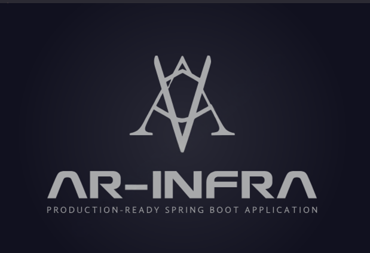
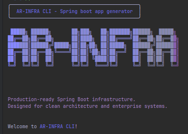

<p align="center">
  
</p>

<h1 align="center">ar-infra-cli</h1>

<p align="center">
  <strong>CLI generator for production-ready Spring Boot backends</strong><br/>
  Opinionated infrastructure scaffolding powered by ar-infra-template
</p>

<p align="center">
  <a href="https://github.com/Abega1642/ar-infra-cli/actions">
    
  </a>
  <a href="https://github.com/Abega1642/ar-infra-cli/blob/main/LICENSE">
    
  </a>
  
  
  
</p>

<p align="center">
  
</p>

<p align="center">
  <sub>Designed & maintained by <a href="https://github.com/Abega1642">Abegà Razafindratelo</a></sub>
</p>

---

<p align="center">
  
</p>

---

## Table of Contents

- [Introduction](#introduction)
- [What's New in v0.1.3](#whats-new-in-v013)
- [What is ar-infra?](#what-is-ar-infra)
- [What is ar-infra-template?](#what-is-ar-infra-template)
- [What is ar-infra-cli?](#what-is-ar-infra-cli)
- [Installation](#installation)
- [Usage](#usage)
  - [Interactive Mode](#interactive-mode)
  - [Command Line Mode](#command-line-mode)
  - [Available Options](#available-options)
  - [Feature Flags](#feature-flags)
- [Examples](#examples)
- [Generated Project Structure](#generated-project-structure)
- [System Requirements](#system-requirements)
- [Conclusion](#conclusion)

---

## Introduction

The **ar-infra-cli** is a command-line tool designed to generate **production-ready Spring Boot applications**. It leverages the [ar-infra-template](https://github.com/Abega1642/ar-infra-template.git) as its foundation, ensuring that every generated project starts with a complete, enterprise-grade infrastructure.

This CLI automates the creation of new backend services, eliminating the repetitive setup work and enforcing consistent architecture and security practices across projects.

---

## What's New in v0.1.3

### GitHub App Integration

- **Automated repository setup**: The ar-infra-bot GitHub App now handles repository authorization during project generation
- **Working CI/CD out-of-the-box**: CodeQL and Semgrep workflows are automatically configured with proper permissions
- **Secure authorization flow**: GitHub App provides secure, scoped access without requiring personal access tokens
- **Optional integration**: Use `--skip-github-app` flag if you want to set up GitHub manually or don't need CI/CD

### Enhanced User Experience

- **Improved CLI messaging**: Clearer, more informative messages throughout the project generation process
- **Intuitive workflow**: Smoother project setup experience with contextual prompts

### Bug Fixes

- **Fixed formatting with no features**: Project formatting now works correctly even when no infrastructure features are selected
- **Resolved CI authorization issues**: CodeQL and Semgrep workflows no longer fail due to permission problems
- **Improved error handling**: Better error messages when GitHub authorization is needed

---

## What is ar-infra?

**ar-infra** refers to the architecture and infrastructure baseline defined by this ecosystem. It represents a structured, production-ready backend stack that includes:

- Messaging (RabbitMQ)
- Storage (S3-compatible bucket)
- Database (PostgreSQL with Flyway migrations)
- Email service
- Security configuration
- Health check endpoints
- Integration testing with Testcontainers
- CI/CD workflows
- Dockerized runtime environment
- OpenAPI documentation with Swagger UI

This architecture is designed to be reliable, maintainable, and secure, suitable for enterprise-scale applications.

---

## What is ar-infra-template?

The [ar-infra-template](https://github.com/Abega1642/ar-infra-template.git) is the **base template** that implements the ar-infra architecture. It provides the full project structure, configurations, validators, health endpoints, and CI/CD pipelines.

It is not intended to be cloned and customized manually. Instead, it serves as the **foundation** for generated projects, ensuring that every new application starts with the same solid infrastructure.

For more information about the ar-infra architecture, visit the [ar-infra-template repository](https://github.com/Abega1642/ar-infra-template.git).

---

## What is ar-infra-cli?

The **ar-infra-cli** is the tool that generates new Spring Boot projects based on the ar-infra-template. It provides customization options such as:

- **groupId** and **artifactId**
- **Project version**
- **Feature selection** (add or remove components as needed)
- **Target location** customization
- **GitHub App integration** for automated CI/CD setup

By running a single command, developers can bootstrap a fully configured Spring Boot application based on the ar-infra architecture without manual setup.

---

## Installation

### Binary Installation (Recommended)

#### Linux (x64)

```bash
curl -LO https://github.com/Abega1642/ar-infra-cli/releases/download/v0.1.3/ar-infra-linux-amd64
curl -LO https://github.com/Abega1642/ar-infra-cli/releases/download/v0.1.3/ar-infra-linux-amd64.sha256
shasum -a 256 -c ar-infra-linux-amd64.sha256
chmod +x ar-infra-linux-amd64
sudo mv ar-infra-linux-amd64 /usr/local/bin/ar-infra
```

#### macOS (Intel)

```bash
curl -LO https://github.com/Abega1642/ar-infra-cli/releases/download/v0.1.3/ar-infra-macos-amd64
curl -LO https://github.com/Abega1642/ar-infra-cli/releases/download/v0.1.3/ar-infra-macos-amd64.sha256
shasum -a 256 -c ar-infra-macos-amd64.sha256
chmod +x ar-infra-macos-amd64
sudo mv ar-infra-macos-amd64 /usr/local/bin/ar-infra
```

#### macOS (Apple Silicon)

```bash
curl -LO https://github.com/Abega1642/ar-infra-cli/releases/download/v0.1.3/ar-infra-macos-arm64
curl -LO https://github.com/Abega1642/ar-infra-cli/releases/download/v0.1.3/ar-infra-macos-arm64.sha256
shasum -a 256 -c ar-infra-macos-arm64.sha256
chmod +x ar-infra-macos-arm64
sudo mv ar-infra-macos-arm64 /usr/local/bin/ar-infra
```

#### Windows (PowerShell as Administrator)

```powershell
Invoke-WebRequest -Uri "https://github.com/Abega1642/ar-infra-cli/releases/download/v0.1.3/ar-infra-windows-amd64.exe" -OutFile "ar-infra.exe"
Invoke-WebRequest -Uri "https://github.com/Abega1642/ar-infra-cli/releases/download/v0.1.3/ar-infra-windows-amd64.exe.sha256" -OutFile "ar-infra.exe.sha256"
certutil -hashfile ar-infra.exe SHA256
Move-Item ar-infra.exe C:\Windows\System32\ar-infra.exe
```

### Python Package Installation

Using pipx (recommended for CLI tools):

```bash
pipx install ar-infra-cli
```

Using pip:

```bash
pip install ar-infra-cli
```

---

## Usage

The **ar-infra-cli** provides a single command: `ar-infra init`. This command can be used in two modes: interactive or command-line.

### Interactive Mode

The interactive mode guides you through project setup with prompts for each configuration option. This is the recommended approach for first-time users.

```bash
ar-infra init
```

The CLI will ask you to provide:

- Group ID (e.g., `com.example`)
- Artifact ID (e.g., `myapp`)
- Project version (e.g., `1.0.0`)
- Output path
- Features to include or exclude
- GitHub repository setup (optional)

When you choose to push your project to a repository, the CLI will guide you through automated authorization via the ar-infra-bot GitHub App, ensuring your CI/CD workflows work immediately.

### Command Line Mode

For automation or quick generation, all options can be provided directly via command-line flags.

```bash
ar-infra init --group=com.example --artifact=myapp --project-version=1.0.0
```

Skip GitHub App integration if you don't need CI/CD setup:

```bash
ar-infra init \
  --group=com.example \
  --artifact=backend-api \
  --skip-github-app
```

### Available Options

| Option               | Description                                 | Example                |
| -------------------- | ------------------------------------------- | ---------------------- |
| `--group`            | Maven group ID for the project              | `com.example`          |
| `--artifact`         | Maven artifact ID for the project           | `backend-api`          |
| `--project-version`  | Version of the generated project            | `1.0.0`                |
| `--path`             | Directory where the project will be created | `/home/user/projects`  |
| `--project-dir`      | Name of the project directory               | `my-project`           |
| `--features`         | Comma-separated list of features to include | `postgresql,s3_bucket` |
| `--disable-features` | Comma-separated list of features to exclude | `rabbitmq,email`       |
| `--no-cache`         | Skip template caching and fetch fresh       | N/A                    |
| `--skip-github-app`  | Skip GitHub App integration                 | N/A                    |

### Feature Flags

The following features can be enabled or disabled during project generation:

| Feature      | Description                                        |
| ------------ | -------------------------------------------------- |
| `postgresql` | PostgreSQL database support with Flyway migrations |
| `rabbitmq`   | RabbitMQ message broker integration                |
| `s3_bucket`  | AWS S3-compatible storage integration (BackBlaze)  |
| `email`      | Email sending capabilities                         |

By default, all features are enabled. Use `--disable-features` to exclude specific components.

---

## Examples

### Basic Usage

Generate a project with default settings in interactive mode:

```bash
ar-infra init
```

### Quick Start

Generate a project with minimal configuration:

```bash
ar-infra init --group=com.mycompany --artifact=backend-api
```

### Full Customization

Generate a project with all options specified:

```bash
ar-infra init \
    --group=dev.razafindratelo \
    --artifact=cool-project \
    --project-version=2.0.0 \
    --path=/home/user/projects \
    --project-dir=cool-project \
    --features=postgresql,s3_bucket
```

### Minimal Configuration

Generate a project without messaging and email features:

```bash
ar-infra init \
    --group=com.example \
    --artifact=minimal-api \
    --disable-features=rabbitmq,email
```

### Fresh Template Fetch

Generate a project with fresh template (bypass cache):

```bash
ar-infra init \
    --group=com.example \
    --artifact=myapp \
    --no-cache
```

---

## Generated Project Structure

Projects generated by **ar-infra-cli** include:

- Complete Spring Boot application structure
- Gradle build configuration
- Docker and Docker Compose setup
- CI/CD workflows (GitHub Actions)
- Integration tests with Testcontainers
- Health check endpoints
- OpenAPI documentation
- Security configuration
- Database migration scripts (Flyway)
- Message broker configuration
- S3 storage integration
- Email service configuration

---

## System Requirements

### Binary Distribution

- **Linux**: x86_64 architecture, GLIBC 2.17+
- **macOS**: 10.13+ (Intel), 11.0+ (Apple Silicon)
- **Windows**: Windows 10/11, x86_64 architecture

### Python Package

- **Python**: 3.11 or higher
- **Package Manager**: pip or pipx

### Additional Requirements

- Internet connectivity for GitHub App integration (optional)
- Git installed for repository operations

---

## Conclusion

The **ar-infra-cli** is the entry point for teams adopting the ar-infra architecture. By combining the solid foundation of **ar-infra-template** with the automation of a CLI tool, it enables developers to start new backend projects quickly, consistently, and securely.

With v0.1.3, GitHub App integration ensures your CI/CD pipelines work immediately after your first push, eliminating the friction of manual repository setup.

This tool is maintained by **Abegà Razafindratelo**. For questions, issues, or contributions, please refer to the project repository or contact directly at [a.razafindratelo@gmail.com](mailto:a.razafindratelo@gmail.com).

For more information, visit the [ar-infra-template repository](https://github.com/Abega1642/ar-infra-template).

---

## Support and Documentation

- **Repository**: [https://github.com/Abega1642/ar-infra-cli](https://github.com/Abega1642/ar-infra-cli)
- **Issue Tracker**: [https://github.com/Abega1642/ar-infra-cli/issues](https://github.com/Abega1642/ar-infra-cli/issues)
- **Template Repository**: [https://github.com/Abega1642/ar-infra-template](https://github.com/Abega1642/ar-infra-template)
- **GitHub App**: ar-infra-bot (installation guided during project setup)

---

## Security Considerations

- Binary integrity verification via SHA256 checksums is strongly recommended
- All binaries are built via GitHub Actions with full transparency
- Secrets are now injected at build time rather than bundled, improving security
- The ar-infra-bot GitHub App uses minimal, scoped permissions
- No code signing is provided; users should verify checksums before execution
- Source code is available for audit
